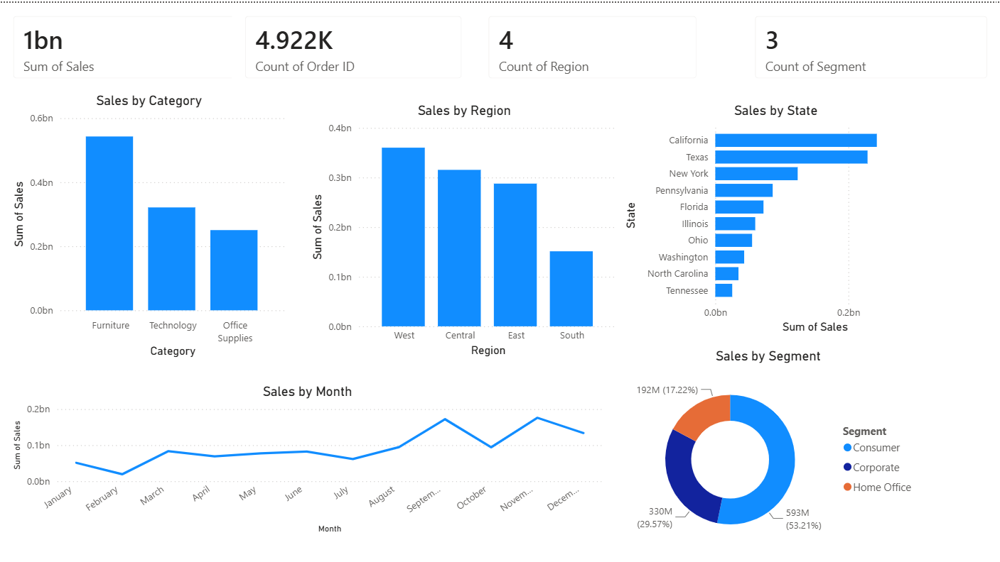

# 📊 Retail Sales Exploratory Data Analysis (EDA)

## 📌 Project Overview

Retail sales datasets contain valuable business insights, but raw transaction data often requires proper cleaning, analysis, and visualization to identify meaningful patterns.

In this project, I performed Exploratory Data Analysis (EDA) using Python to clean and analyze retail sales data, uncover trends, and generate actionable business insights. Additionally, I developed an interactive Power BI dashboard to visualize sales performance across categories, regions, states, customer segments, and monthly trends.

The project demonstrates how data analysis and visualization can transform raw sales data into clear insights that support data-driven decision-making.

## 🎯 Business Objective

The objective of this project is to transform raw retail transaction data into meaningful business insights that can support better decision-making.
---
## 🛠 Tech Stack

- Python
- Jupyter Notebook
- Pandas
- NumPy
- Matplotlib
- Power BI
---
## 📂 Dataset

**Source:** Kaggle – Superstore Sales Dataset

- Dataset Name: Superstore Sales Dataset
- Records: 9,800 retail transactions
- Contains information about orders, customers, products, regions, categories, and sales.
---
## Project Workflow

- Data loading and initial exploration using Python
- Data cleaning and preprocessing
- Handling missing values and duplicate records
- Data type conversion and Sales column formatting
- Exploratory Data Analysis (EDA) to identify sales patterns
- Category-wise sales analysis
- Region-wise sales comparison
- State and product performance analysis
- Customer segment analysis
- Monthly sales trend analysis
- Sales distribution analysis and outlier identification
- Creating visualizations using Matplotlib
- Developing an interactive Power BI dashboard for business insights
---
## Key Analysis Performed

### Category-wise Sales Analysis
Analyzed sales contribution from different product categories to identify the highest revenue-generating categories.

### Region-wise Sales Analysis
Compared sales performance across different regions to understand regional contribution.

### Top 10 States by Sales
Identified states generating the highest sales revenue.

### Top 10 Products by Sales
Analyzed products contributing significantly to overall sales.

### Monthly Sales Trend
Studied monthly sales patterns to identify fluctuations and seasonal trends.

### Customer Segment Analysis
Compared sales among different customer segments:
- Consumer
- Corporate
- Home Office

---

## 📊 Interactive Dashboard

An interactive Power BI dashboard was created to visualize key retail sales insights and enable better business understanding.

### Dashboard Preview

📁 Power BI Dashboard File:
[Power BI Dashboard](images/Retail_Sales_Dashboard.pbix)

### Dashboard Highlights
- Category-wise sales analysis
- Region and state performance comparison
- Customer segment insights
- Monthly sales trends
- Interactive filtering for deeper analysis
---
## 💡 Key Insights

- Furniture generated the highest total sales among all categories, followed by Technology and Office Supplies.
- The West region recorded the highest overall sales.
- California and Texas were the top-performing states.
- The Consumer segment contributed the largest share of total sales.
- Monthly sales trends showed noticeable fluctuations and seasonal patterns.
- A few transactions had unusually high sales values, reflecting characteristics of the source dataset.
- The Power BI dashboard enabled interactive filtering to explore sales performance across multiple dimensions.
---
## ⚙️ Skills Demonstrated

- Data Cleaning
- Data Preprocessing
- Exploratory Data Analysis (EDA)
- Data Visualization
- Dashboard Development
- Business Insight Generation
- Data Storytelling
- Pandas
- NumPy
- Matplotlib
- Power BI
---
## 📝 Note on Data

Some sales values in this dataset are unusually high compared to typical retail transactions. These values are part of the original dataset and were not modified during data cleaning.
---
## ✅ Conclusion

This project demonstrates how Exploratory Data Analysis (EDA) and interactive dashboarding can be used to transform raw retail sales data into meaningful insights using Python and Power BI.

---
## 👩‍💻 Author

**Riya Singh**

- GitHub: https://github.com/ri-ya24
- LinkedIn:https://www.linkedin.com/in/riya-singh-1696b7363/

